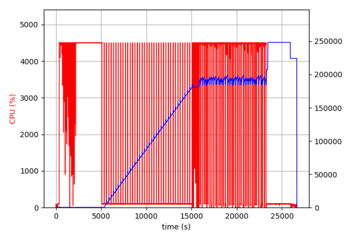
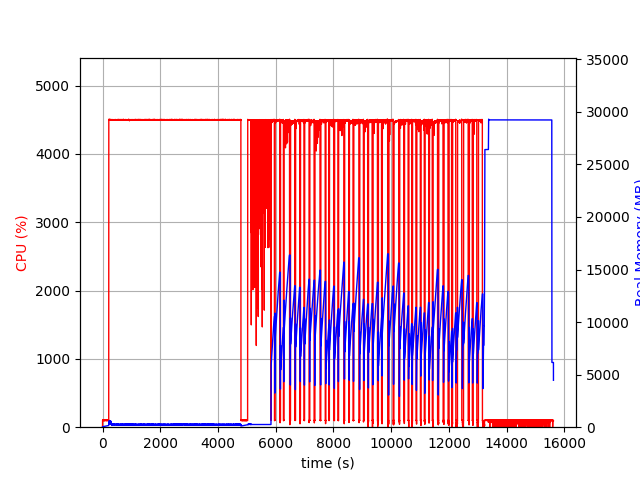
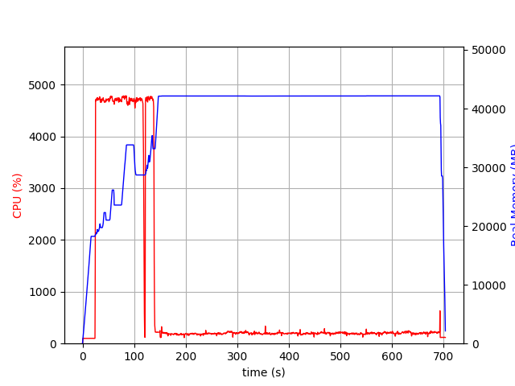
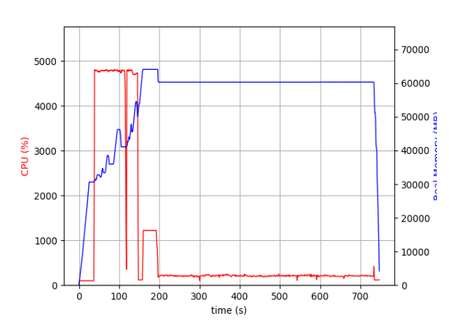
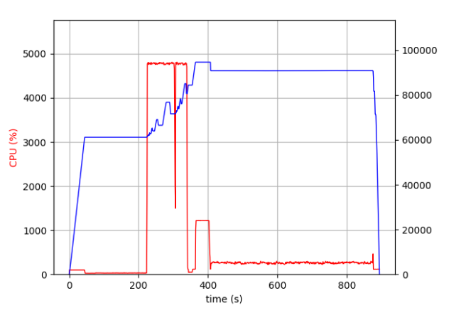
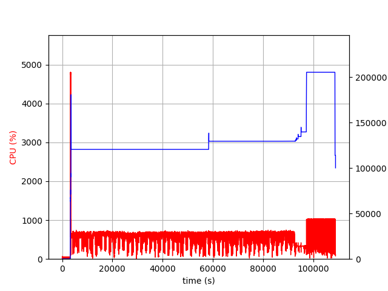
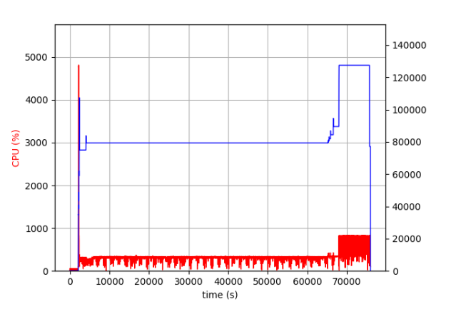
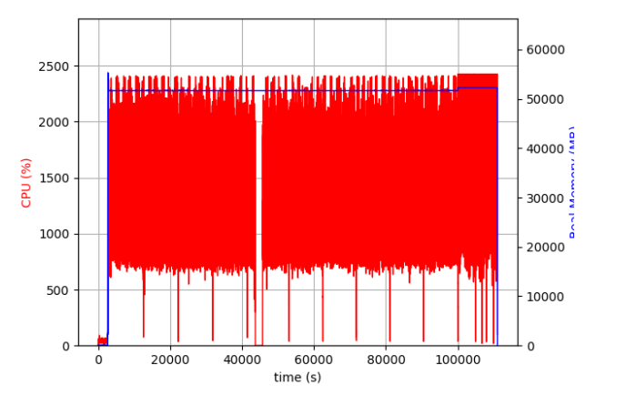

## OdinANN内存分析与优化

### 原始OdinANN代码系统级内存分析与优化

#### 概览

在整个由OdinANN主导的近似向量检索系统中，内存峰值主要受四个核心操作的影响。本节主要分析**原始OdinANN代码**中各个核心操作的内存模型，并根据分析结果优化代码，给出优化后的峰值估算公式，最终总结得到整个系统在运行时的内存峰值，为检索系统服务器采购提供指导，也为用户进行各个操作的最大可行参数提供参考。

* 内存降低方面：

  * 将多分片场景下（48）**构建**1B向量索引时内存峰值降低87.5%，10分片场景下降低30%；

  * 将0.99B插入10M场景下内存消耗降低50%；

* 内存估算方面：

  * 将构建时期内存估算误差率从93.6%降低至6%；
  * 给出了搜索、插入、删除向量时精确的内存估算公式。

* 速度提升方面：

  * 将索引构建耗时由7.7h降低至4.4h。

#### 优化前的构建

##### 基于阶段的分析

###### 原始向量数据PQ编码

占用内存很小（几百兆可以忽略不计）

###### 基于kmeans聚类与内存限制的分片操作

**有内存泄漏，解释了内存线性增长，将在后续章节介绍优化效果**

```cpp
// partition_and_pq.cpp
template<typename T>
int estimate_cluster_sizes(const std::string data_file, float *pivots, const size_t num_centers, const size_t dim,
                           const size_t k_base, std::vector<size_t> &cluster_sizes) {
  // ...
  float *test_data_float;
  double sampling_rate = 0.01;

  // 这里动态分配了内存给 test_data_float
  gen_random_slice<T>(data_file, sampling_rate, test_data_float, num_test, test_dim);
  // ...
  
  delete[] shard_counts;
  delete[] block_closest_centers;
  return 0; // BUG: test_data_float 没有被 delete[]！
}
```

###### 逐分片构建Vamana图索引

* 估算公式不准确

  **OdinANN的单分片内存峰值估算公式：**

  ```cpp
  // index.h
  inline double estimate_ram_usage(size_t size, size_t dim, size_t datasize, size_t degree) {
      double graph_size = (double) size * (double) degree * (double) sizeof(unsigned) * SLACK_FACTOR;
      size_t data_size = size * ROUND_UP(dim, 8) * datasize;
      return OVERHEAD_FACTOR * (graph_size + data_size);
    }
  ```

  **原始DiskANN的内存峰值估算公式：**

  ```cpp
  inline double estimate_ram_usage(size_t size, uint32_t dim, uint32_t datasize, uint32_t degree)
  {
      double size_of_data = ((double)size) * ROUND_UP(dim, 8) * datasize;
      double size_of_graph = ((double)size) * degree * sizeof(uint32_t) * defaults::GRAPH_SLACK_FACTOR;
      double size_of_locks = ((double)size) * sizeof(non_recursive_mutex);
      double size_of_outer_vector = ((double)size) * sizeof(ptrdiff_t);
  
      return OVERHEAD_FACTOR * (size_of_data + size_of_graph + size_of_locks + size_of_outer_vector);
  }
  ```

  经过代码比对发现，OdinANN的索引为了支持高效更新，牺牲了一定的数据一致性，不再维护以下数据结构：

  ```cpp
  // Per node lock, cardinality=_max_points + _num_frozen_points
      std::vector<non_recursive_mutex> _locks;
  ```

  而是维护锁表：

  ```cpp
  v2::LockTable *_locks = nullptr;
  ```

  这部分开销很低，可以忽略不计。

  但是邻接表的数据结构是：`std::vector<std::vector<unsigned>>`

  OdinANN的估算公式忽略了内层vector对象本身占用的24字节。

* **总而言之，正确的单分片估算公式如下：**

  ```cpp
  inline double estimate_ram_usage(size_t size, size_t dim, size_t datasize, size_t degree) {
      // double graph_size = (double) size * (double) degree * (double) sizeof(unsigned) * SLACK_FACTOR;
      // 图存储：除了邻居节点ID，还需加上std::vector对象本身的24字节开销 changecode
      double graph_size = (double)size * ((double)degree * sizeof(unsigned) * SLACK_FACTOR + 24);
      size_t data_size = size * ROUND_UP(dim, 8) * datasize;
      return OVERHEAD_FACTOR * (graph_size + data_size);
    }
  ```

###### 合并分片（和原始DiskANN分析一致）

* 公式：

  
  $$
  M_{merge} = \underbrace{(N \times R \times 4)}_{\text{idmaps}} + \underbrace{(N \times R \times 8)}_{\text{node\_shard}} + M_{ReadBuffers} + \underbrace{\frac{N}{8}}_{\text{bitmap}}
  $$
  

  * $idmaps$：ID映射表。将所有分片中旧 ID 到新 ID 的映射全部加载到了内存中。
  * $node\_shard$：反向映射表。将所有分片中全局新 ID 到旧 ID 的映射全部加载到了内存中。
  * $Reader\ Buffers$：输入文件缓存。源代码同时打开了所有分片的文件句柄，并且为每一个分片都分配了一个独立的读取缓冲区。
  * $bitmap$：用于合并邻居时去重。

* `idmaps`：ID映射表。将所有分片中旧 ID 到新 ID 的映射全部加载到了内存中。

  ```cpp
  std::vector<std::vector<uint32_t>> idmaps(nshards);
  for (uint64_t shard = 0; shard < nshards; shard++)
  {
      vamana_names[shard] = vamana_prefix + std::to_string(shard) + vamana_suffix;
      read_idmap(idmaps_prefix + std::to_string(shard) + idmaps_suffix, idmaps[shard]);
  }
  ```

* `node_shard`：反向映射表。将所有分片中全局新 ID 到旧 ID 的映射全部加载到了内存中。

  ```cpp
  size_t nelems = 0;
  for (auto &idmap : idmaps)
  {
      for (auto &id : idmap)
      {
          nnodes = std::max(nnodes, (size_t)id);
      }
      nelems += idmap.size();
  }
  
  std::vector<std::pair<uint32_t, uint32_t>> node_shard;
  node_shard.reserve(nelems);
  for (size_t shard = 0; shard < nshards; shard++)
  {
      diskann::cout << "Creating inverse map -- shard #" << shard << std::endl;
      for (size_t idx = 0; idx < idmaps[shard].size(); idx++)
      {
          size_t node_id = idmaps[shard][idx];
          node_shard.push_back(std::make_pair((uint32_t)node_id, (uint32_t)shard));
      }
  }
  ```

* `nhood_set`:用于合并邻居时去重。

  ```cpp
  std::vector<bool> nhood_set(nnodes, 0);
  ```

* 输入缓冲区：源代码同时打开了所有分片的文件句柄，并且为每一个分片都分配了一个独立的读取缓冲区，缓冲区大小为1GB每分片。

  ```cpp
  std::vector<cached_ifstream> vamana_readers(nshards);
  for (size_t i = 0; i < nshards; i++)
  {
      vamana_readers[i].open(vamana_names[i], BUFFER_SIZE_FOR_CACHED_IO);
      size_t expected_file_size;
      vamana_readers[i].read((char *)&expected_file_size, sizeof(uint64_t));
  }
  ```

##### 基于优化点的分析

###### 解决了内存泄漏的BUG

在`estimate_cluster_sizes`函数的末尾添加了`delete[] test_data_float;`。解决了内存泄漏的问题，在分片构建前的内存线性增长问题得到了解决。


###### 降低merge时IO缓冲区的大小

将硬编码的1GB的IO缓存改成了64MB，解决了因为分片数量增多、IO缓冲区增大导致的内存爆炸

现代操作系统的 Page Cache 已经很聪明了，应用程序层的 Buffer 没必要设置1GB，适当减小缓存对吞吐量的影响在 SSD 上微乎其微，但能省下极大的内存空间。


###### 优化了单个分片的内存估算公式，在对分片构建的内存峰值估算时能够更加精确

```cpp
inline double estimate_ram_usage(size_t size, size_t dim, size_t datasize, size_t degree) {
    // double graph_size = (double) size * (double) degree * (double) sizeof(unsigned) * SLACK_FACTOR;
    // 图存储：除了邻居节点ID，还需加上std::vector对象本身的24字节开销 changecode
    double graph_size = (double)size * ((double)degree * sizeof(unsigned) * SLACK_FACTOR + 24);
    size_t data_size = size * ROUND_UP(dim, 8) * datasize;
    return OVERHEAD_FACTOR * (graph_size + data_size);
  }
```


###### 速度优化：在试探分片数量时只采样一次，避免每一次评估内存是否满足要求都要采样导致效率很低

在 `partition_and_pq.cpp` 的 `partition_with_ram_budget` 函数中，为了找到合适的分片数（`num_parts`），代码使用了一个 `while (!fit_in_ram)` 循环。在这个循环内部，它调用了 `estimate_cluster_sizes` 来评估当前分片数下的内存占用。

而在 `estimate_cluster_sizes` 函数内部，有这样一行代码：

```cpp
gen_random_slice<T>(data_file, sampling_rate, test_data_float, num_test, test_dim);
```

这行代码的作用是打开你那个庞大的基础数据文件（比如 10 亿个向量），逐个读取，并使用随机数生成器按 1% 的概率（`sampling_rate = 0.01`）进行采样。假设在 $M=8$ 的情况下，`while` 循环需要执行 80 次才能找到满足内存限制的 `num_parts`：

* 程序会把这 10 亿条数据的巨型文件**从硬盘里完整读取 80 次**

* CPU 会为这 10 亿条数据**生成 800 亿次随机数**来决定是否采样

* 程序会申请并（如果之前的 bug没修复的话）泄漏 80 次约 5GB 的内存

对于固定的数据集来说，无论打算分成 3 个片还是 80 个片，用来做评估的“1% 采样数据”完全可以是同一批数据，根本没必要每次循环都重新去硬盘里抽样一遍。

因此我将`gen_random_slice`从`estimate_cluster_sizes`中剥离，放置在`partition_with_ram_budget`的`while`循环外侧。


###### 速度优化：在shard_data_into_clusters函数中新增缓冲区，不是计算出来一个向量就写入，减少了开销

```cpp
// 遍历当前块中的每个向量
for (size_t p = 0; p < cur_blk_size; p++) {
  for (size_t p1 = 0; p1 < k_base; p1++) {
    // 找出该向量属于哪个分片
    size_t shard_id = block_closest_centers[p * k_base + p1];
    uint32_t original_point_map_id = (uint32_t) (start_id + p);
    
    // 【可优化点】直接对该分片的文件流发起 write 调用！
    shard_data_writer[shard_id].write((char *) (block_data_T.get() + p * dim), sizeof(T) * dim);
    shard_idmap_writer[shard_id].write((char *) &original_point_map_id, sizeof(uint32_t));
    
    shard_counts[shard_id]++;
  }
}
```

* 写请求太小： 数据是 128 维的 `uint8`，那么 `sizeof(T) * dim` 仅仅是 **128 字节**。`original_point_map_id` 只有 **4 字节**。

* 目标文件频繁跳跃：  `shard_id` 是通过 K-Means 聚类分配的，这意味着相邻的两个向量极大概率属于完全不同的分片。因此，写入流会在 `shard_data_writer[0]`、`shard_data_writer[18]`、`shard_data_writer[5]` 之间疯狂横跳。

* 系统调用与缓存抖动： 10 亿个向量，意味着代码发起了 **20 亿次** 极小字节的 `write()` 调用。虽然 C++ 的 `std::ofstream` 在底层有自己的缓冲区（通常是 4KB 或 8KB），但你在几十个文件流（$M=8$ 时分片可能多达几十个）之间交替触发写入，极易引发内核级 Page Cache 的严重抖动（Thrashing）和写放大。

**修改：**

引入应用层buffer，为每个buffer安排一个1MB大小的写缓冲区，当向量写满缓冲区后再进行落盘。

###### 在经过上述修改后的实验后发现还可以省下5GB的内存峰值，通过优化分片时测试集的采样逻辑实现

在经过试验后发现：之前为了训练K-Means采样了一个训练数据集，然后为了估算聚类后每个分片的大小，又采样了一个测试数据集。然而，测试数据集的采样率为硬编码的0.01，没有像训练数据集一样有最大绝对体积的限制，因此在10亿128维向量的情况下，0.01的采样率就是1000万条数据，并且转化成了float类型，因此刚好就是5GB。

为什么会有峰值上升到13GB？有一段时间的双倍内存驻留。

```cpp
template<typename T>
void gen_random_slice(const std::string data_file, double p_val, float *&sampled_data, size_t &slice_size, size_t &ndims) {
  // ...
  std::vector<std::vector<float>> sampled_vectors; // 【问题点】
  
  for (size_t i = 0; i < npts; i++) {
    // ...
    if (rnd_val < (float) p_val) {
      // 读出 128 维数据，放进一个临时的 vector 里
      std::vector<float> cur_vector_float;
      // ...
      // 然后 push 到大 vector 里
      sampled_vectors.push_back(cur_vector_float);
    }
  }

  // ...
  sampled_data = new float[slice_size * ndims]; // 【问题点】
  // ... 互相拷贝
}
```

优化方案：直接使用训练数据集进行分片大小估算，自带安全熔断机制，并且没有额外采样的开销。最多只会有200MB的额外内存开销

#### 优化后的构建

##### 总内存估算公式

$M_{build} = max(M_{single}，M_{merge})*OVERHEAD$


$$
M_{single} = \phi \cdot \left( \underbrace{N \cdot (D \cdot 4 \cdot \sigma + 24)}_{\text{Graph Storage}} + \underbrace{N \cdot \lceil dim \rceil_8 \cdot B_{data}}_{\text{Data Storage}} \right)
$$


* 这里将 `SLACK_FACTOR` 记作 $\sigma$（冗余因子），`OVERHEAD_FACTOR` 记作 $\phi$（开销系数），并将 `ROUND_UP(dim, 8)` 记作 $\lceil dim \rceil_8$（8字节对齐后的维度）。
* $\phi=1.1$
* $\sigma=1.3$

* 
  $$
  M_{merge} = \underbrace{(N \times R \times 4)}_{\text{idmaps}} + \underbrace{(N \times R \times 8)}_{\text{node\_shard}} + M_{ReadBuffers} + \underbrace{\frac{N}{8}}_{\text{bitmap}}
  $$
  

* OVERHEAD=1.2

##### 估算准确度提升

* 原始估算公式

  * 真实峰值250G，估算峰值16GB

    

  * 相对误差率：$\frac{|V_{actual} - V_{estimated}|}{V_{actual}}=93.6\%$

* 新计算公式：

  第二版优化后：

  

  * 真实峰值：29GB **（分片构建期间5GB的底座问题没有解决，经分析大概率是内存碎片）** 

  * 估算峰值： $M_{build} = max(M_{single}，M_{merge}) * OVERHEAD=31GB$ 

    * $M_{single}=16GB$

    * $M_{merge}$计算：

      - **idmaps**:  $N \times R \times 4 = 10^9 \times 2 \times 4 = 8,000,000,000$  字节 ($\approx 7.45$ GiB)
      - **node_shard**: $N \times R \times 8 = 10^9 \times 2 \times 8 = 16,000,000,000$ 字节 ($\approx 14.90$ GiB)
      - **M_{ReadBuffers}**: $48 \times 64 \text{ MB} = 3,072 \text{ MB} = 3,221,225,472$ 字节 ($3$ GiB)
      - **bitmap**: $\frac{N}{8} = \frac{10^9}{8} = 125,000,000$ 字节 ($\approx 0.12$ GiB)

      $$M_{merge} = 8,000,000,000 + 16,000,000,000 + 3,221,225,472 + 125,000,000$$

      $$M_{merge} = 27,346,225,472 \text{ 字节}$$

      **以 GiB 为单位 (二进制，1024进制)**：

      $$27,346,225,472 \div 1024^3 \approx \mathbf{25.47 \text{ GiB}}$$

  * 相对误差率：  $\frac{|V_{actual} - V_{estimated}|}{V_{actual}}=6\%$  

* 总结：估算误差率可由原本的93.6%降低至6%，实现了精确估算构建时内存峰值。观察多次构建记录发现这部分的值大约都是5GB左右，因此为了保证估算值大于真实值，在现有估算公式基础上增大一定比例。

##### 内存消耗降低

由原本的250GB降低至29GB，变为了原来的八分之一。

#### 搜索

##### 分析内容-R32_L32_B18_M16

> PQ量化压缩向量磁盘上大小：17.7GB，没有tags文件



* 0-15s：线性上升的为17.7GB的PQ量化向量、以及PQ中心点开销
* 15~150s：加载SSDIndex的开销
* 150-700s：实际搜索与写入过程

##### 内存估算公式

* 这里是 `SSDIndex::load` 阶段内存开销的精确数学计算公式。

  为了方便表示，我们先定义以下关键变量：

  - $N$: 向量总数（日志中为 $10^9$）
  - $n_{chunks}$: PQ 压缩的块数（日志中为 $19$）
  - $D$: 原始向量维度（日志中为 $128$）
  - $D_{align}$: 内存对齐后的维度（日志中为 $128$）
  - $P_{nodes}$: 每个磁盘页（Sector）能容纳的节点数（日志中 `nnodes_per_sector` 为 $15$）
  - $N_{threads}$: 并发线程数（日志中为 $12$）
  - $\alpha_{cuckoo}$: `libcuckoo` 并发哈希表的空间膨胀系数（为了维持低碰撞率和并发性能，通常 $\alpha_{cuckoo} \approx 1.5 \sim 2.0$）

  总常驻内存 $M_{load}$ 的计算公式可以表示为：

  $$M_{load} = M_{PQ} + M_{id2loc} + M_{page\_layout} + M_{buffers} + M_{tags}$$

  ------

  ###### 1. PQ 压缩向量与质心开销 ($M_{PQ}$)

  这是数据本身占用的常驻内存，主要包含压缩后的量化特征和 PQ 的查找表。

  
  $$
  M_{PQ} = \underbrace{(N \times n_{chunks} \times 1 \text{ Byte})}_{\text{data (压缩向量)}} + \underbrace{(256 \times D \times 4 \text{ Bytes})}_{\text{pq\_table (PQ质心表)}}
  $$
  

  > **代入数据**： $10^9 \times 19 + 256 \times 128 \times 4 \approx \mathbf{17.7 \text{ GB}}$ 

  ------

  ###### 2. ID 到 磁盘位置 的映射表 ($M_{id2loc}$)

  在不开启 `NO_MAPPING` 宏的情况下，需要记录每个点的逻辑 `id` (`uint32_t`) 到磁盘物理 `loc` (`uint32_t`) 的映射。

  
  $$
  M_{id2loc} = \underbrace{(N \times (4 \text{ Bytes} + 4 \text{ Bytes}))}_{\text{键值对基础大小}} \times \underbrace{\alpha_{cuckoo}}_{\text{哈希表膨胀系数}}
  $$
  

  ```cpp
  libcuckoo::cuckoohash_map<uint32_t, uint32_t> id2loc_;  // id -> loc
  ```

  * SSD 图索引通过逻辑 ID 来表示节点。但在磁盘上，节点按照紧凑的物理顺序 (`loc`) 存储。为了在搜索时知道一个逻辑 ID 对应在磁盘的哪个位置，必须在内存中维护一个映射表：`ID (uint32_t) -> Loc (uint32_t)`。
  * 为什么会有 $\alpha_{cuckoo}$ 膨胀系数？代码使用了 `libcuckoo::cuckoohash_map` 这种支持高并发的哈希表。为了避免哈希冲突和保证并发读写性能，哈希表不能 100% 填满（通常装载率达到 50%~70% 就会触发扩容，底层数组大小通常是 2 的幂），因此实际分配的内存大约是数据的 1.5 到 2 倍。

  > **代入数据**： $10^9 \times 8 \times (1.5 \sim 2.0) \approx \mathbf{12 \text{ GB}} \sim \mathbf{16 \text{ GB}}$ 

  ------

  ###### 3. 磁盘页布局表 ($M_{page\_layout}$)

  记录每个磁盘页（Page/Sector，`uint32_t` 作为 Key）内部按顺序存放了哪些 ID（`PageArr` = 16 个 `uint32_t` 作为 Value）。

  
  $$
  M_{page\_layout} = \underbrace{\left( \lceil \frac{N}{P_{nodes}} \rceil \times (4 \text{ Bytes} + 16 \times 4 \text{ Bytes}) \right)}_{\text{基础大小}} \times \underbrace{\alpha_{cuckoo}}_{\text{哈希表膨胀系数}}
  $$
  

  ```cpp
  static constexpr uint32_t kMaxElemInAPage = 16;
  using PageArr = std::array<uint32_t, kMaxElemInAPage>;
  libcuckoo::cuckoohash_map<uint32_t, PageArr> page_layout;
  ```

  * SSD 的最小读取单位是扇区/页（通常为 $4096 \text{ Bytes}$）。为了高效缓存和锁定，程序需要知道一个 4KB 的磁盘页（Sector）里包含哪些具体的点。

  * $\lceil \frac{N}{P_{nodes}} \rceil$ 表示总页数（10亿个点，每页 15 个点，共约 6666 万页）。

  * Key 是 Page ID（`uint32_t`， $4 \text{ Bytes}$ ），Value 是一个包含 16 个元素的数组 `PageArr`（不足 16 个的补空），每个元素是节点的 ID（`uint32_t`， $4 \text{ Bytes}$ ），因此 Value 占 $64 \text{ Bytes}$。同样的，受 `cuckoohash_map` 膨胀率影响。

  > **代入数据**： $(10^9 / 15) \times 68 \times (1.5 \sim 2.0) \approx \mathbf{6.8 \text{ GB}} \sim \mathbf{9.1 \text{ GB}}$ 

  ------

  ###### 4. 查询与 I/O 缓冲区 ($M_{buffers}$)，较小，估算时可以忽略

  程序为每个线程预分配了 2 个 `QueryBuffer` 对象（用于实现双缓冲及后台异步 I/O）。

  
  $$
  M_{buffers} = \underbrace{(2 \times N_{threads})}_{\text{Buffer总数}} \times \Big( \underbrace{(16384 \times D_{align} \times \text{sizeof}(T))}_{\text{coord\_scratch}} + \underbrace{(N_{sector} \times 4096)}_{\text{sector\_scratch}} + \underbrace{(32768 \times 32 \times 1)}_{\text{aligned\_pq\_coord}} \Big)
  $$
  

  *(注：$N_{sector}$ 对应代码中的 `MAX_N_SECTOR_READS`，通常预设为 1024 左右)*

  > **代入数据**：假设 $T$ 为 `float` (4 Bytes)，单个 Buffer 约占用 $8.3\text{ MB} + 4.1\text{ MB} + 1\text{ MB} \approx 13.4\text{ MB}$。总占用 $24 \times 13.4 \text{ MB} \approx \mathbf{0.32 \text{ GB}}$。

  ------

  ###### 5. 标签映射表 ($M_{tags}$) - 可选项

  如果开启了 `enable_tags`（且有外部标签文件），还需要建立内部 `id` 到外部 `TagT` 类型的映射。

  
  $$
  M_{tags} = \underbrace{(N \times (4 \text{ Bytes} + \text{sizeof}(TagT)))}_{\text{键值对基础大小}} \times \underbrace{\alpha_{cuckoo}}_{\text{哈希表膨胀系数}}
  $$
  

  > **代入数据**：日志中标签数为 0，因此当前为 $\mathbf{0 \text{ GB}}$。如果全量加载 `uint32_t` 标签，又将是额外的 $\mathbf{12 \sim 16 \text{ GB}}$。

* 总结：

  | **模块**               | **估计占用 (GB)** | **备注**                            |
  | ---------------------- | ----------------- | ----------------------------------- |
  | **PQ Compressed Data** | **17.7**          | `std::vector<_u8> data`             |
  | **id2loc_ Map**        | **12 - 16**       | 10 亿个 ID 的位置映射 (cuckoohash)  |
  | **page_layout Map**    | **7 - 9**         | 磁盘页到 ID 的反向映射              |
  | **Query Buffers**      | **~0.4**          | 24 个预分配的查询缓存               |
  | **系统 Page Cache**    | **不确定**        | OS 会缓存读取过的 `disk.index` 文件 |
  | **总计 (RSS)**         | **~37 - 43 GB**   | **不包含** Tags 表和内存索引        |

##### 估算准确度分析

实际开销为43GB，与估算区间值的最大值完美匹配。

**bigann_0.99B_R48_L100_B30_M85插入10M向量后搜索内存开销**



**0.99B BIGANN  R64_L100_B60 + 10M向量搜索时开销**



可以发现峰值大约都等于**PQ量化向量大小+25GB**，其中**25GB**是我们磁盘页面布局表开销、id磁盘位置映射表的开销、IO缓存的开销，大致只与N有关，因此保持不变，进一步验证了估算的准确性。

#### 插入

##### 分析内容

> 目前使用的实验工具为test_insert_search，在插入过程中并行在执行搜索过程。参数遗漏记录了



* 在test_insert_search中，存在DynamicSSDIndex构造函数，这里加载了许多磁盘上的信息，产生了巨大开销

  ```cpp
  pipeann::DynamicSSDIndex<T, TagT> sync_index(paras, index_prefix, index_prefix + "_merge", dist_cmp, metric,
                                                 search_mode, (search_mem_L > 0));
  ```

  在DynamicSSDIndex构造函数中，有：

  ```
  int res = _disk_index->load(_disk_index_prefix_in.c_str(), _num_threads, true, use_page_search);
  ```

  在_disk_index->load中有：

  ```cpp
  pipeann::load_bin<_u8>(pq_compressed_vectors, data, npts_u64, nchunks_u64, pq_vectors_offset);
  
  pq_table.load_pq_centroid_bin(pq_table_bin.c_str(), nchunks_u64, pq_pivots_offset);
  
  this->load_page_layout(index_prefix, nnodes_per_sector, num_points);
  
  if (this->enable_tags) {
        std::string tag_file = disk_index_file + ".tags";
        LOG(INFO) << "Loading tags from " << tag_file;
        this->load_tags(tag_file);
      }
  ```

  在log_tags中，不仅加载了tags文件，还有id2loc映射表：

  ```cpp
  void SSDIndex<T, TagT>::load_tags(const std::string &tag_file_name, size_t offset) {
      size_t tag_num, tag_dim;
      std::vector<TagT> tag_v;
      this->tags.clear();
  
      if (!file_exists(tag_file_name)) {
        LOG(INFO) << "Tags file not found. Using equal mapping";
        // Equal mapping are by default eliminated in tags map.
      } else {
        LOG(INFO) << "Load tags from existing file: " << tag_file_name;
        pipeann::load_bin<TagT>(tag_file_name, tag_v, tag_num, tag_dim, offset);
        tags.reserve(tag_v.size());
        id2loc_.reserve(tag_v.size());
  
  #pragma omp parallel for num_threads(max_nthreads)
        for (size_t i = 0; i < tag_num; ++i) {
          tags.insert_or_assign(i, tag_v[i]);
        }
      }
      LOG(INFO) << "Loaded " << tags.size() << " tags";
    }
  ```

* 对于pagelayout，id2loc_，tags

  ```cpp
  // if ID == tag, then it is not stored.
  libcuckoo::cuckoohash_map<uint32_t, TagT> tags;
  // 键: id (uint32_t, 4字节)
  // 值: TagT (模板参数，未知大小)
      
  libcuckoo::cuckoohash_map<uint32_t, PageArr> page_layout;
  // 键: page_id (uint32_t, 4字节)
  // 值: PageArr (256 * uint32_t = 1024字节)
  
  libcuckoo::cuckoohash_map<uint32_t, uint32_t> id2loc_;
  // 键: id (uint32_t, 4字节)
  // 值: loc (uint32_t, 4字节)
  ```

* 在insert_in_place函数中，第一次插入时候会将PQ大小扩容为1.5倍，原本的64GB会变成96GB

  ```
  uint64_t pq_offset = target_id * n_chunks;
      {
        static std::mutex pq_mu;
        std::lock_guard<std::mutex> lock(pq_mu);
        if (this->data.size() < pq_offset + n_chunks) {
          while (this->data.size() < pq_offset + n_chunks) {
            this->data.resize(1.5 * this->data.size());
          }
        }
        memcpy(this->data.data() + pq_offset, pq_coords.data(), n_chunks);
      }
  ```

* **总结** ：

  初始内存总计128GB，包括：

  * 1.5倍原始PQ压缩向量（64GB * 1.5 = 96GB），PQ中心点数据（较小忽略不计）

  * 三个映射表开销，总计：32GB

    * page_layout：4.15 GB

      ```
      基本数据 = 3,906,250 * 1028字节 ≈ 3.93 GB
      libcuckoo 开销 ≈ 3.93 GB * 1.05 ≈ 4.12 GB
      额外桶数组 ≈ 3,906,250 * 4字节 * 1.5 ≈ 23 MB
      总 PageLayout ≈ 4.15 GB
      ```

    * id2loc_：18 GB

      ```
      条目数 = 1,000,000,000
      原始数据 = 1e9 * 8字节 = 8.0 GB
      libcuckoo 开销 = 1e9 * 10字节（额外）≈ 10 GB
      总 id2loc_ ≈ 18 GB
      ```

    * tags：

      ```
      每个条目：
      键: uint32_t = 4字节
      值: uint8_t = 1字节
      原始大小: 5字节
      libcuckoo开销: 5字节 * 2.0 ≈ 10字节/条目
      总内存: 1e9 * 10字节 = 10.0 GB
      ```

* 最终merge阶段开销，总计87GB：

  * id 映射表：存储所有非删除节点的映射

    ```
    libcuckoo::cuckoohash_map<uint32_t, uint32_t> id_map;  // old_id -> new_id
    // 10亿节点时：~18 GB
    ```

  * 删除节点的邻居表（稀疏），大小取决于删除向量的数量，本测试中无删除向量

    ```
    libcuckoo::cuckoohash_map<uint32_t, std::vector<uint32_t>> deleted_nhoods;
    ```

  * I/O缓冲区：约768MB

    ```cpp
    char *rbuf = nullptr, *wbuf = nullptr;
    alloc_aligned((void **) &rbuf, SECTORS_PER_MERGE * SECTOR_LEN, SECTOR_LEN);          // 读取缓冲区
    alloc_aligned((void **) &wbuf, 2 * SECTORS_PER_MERGE * SECTOR_LEN, SECTOR_LEN);      // 写入缓冲区
    
    // 假设 SECTOR_LEN = 4096, SECTORS_PER_MERGE = 65536
    rbuf = 65536 * 4096 = 256 MB
    wbuf = 2 * 65536 * 4096 = 512 MB
    ```

  * 新的数据数组：

    ```
    std::vector<uint8_t> pq_coords(new_npoints * n_chunks, 0);  // PQ 数据
    std::vector<TagT> new_tags(new_npoints);                     // 新的标签
    
    // new_npoints = 10亿，n_chunks = 64（典型值）
    pq_coords = 1e9 * 64 = 64 GB
    new_tags (uint32_t) = 1e9 * 4 = 4 GB
    总计：68 GB
    ```

* 累加87GB+128GB = 215GB，完美符合峰值

##### 降低开销方法

* 不要在内存中直接扩容1.5倍的PQ向量大小，插入少量向量时，完全没有必要。可以节省30GB内存
* merge阶段不要一下子申请一个全新的PQ数组，而是进行流式更新。可以节省60GB内存
* **总结：**对于本参数的索引的插入过程，有望将内存从215GB降低至110GB

##### 优化前后效果对比（以下使用从test_insert_search工具剥离出来的insert工具）

* 优化前问题：

  > 0.99B Bigann索引  R32_L100_B33插入10M向量，内存峰值为125GB

  * 最初：源代码此处申请原PQ1.5倍的内存，然后拷贝一份旧PQ到此处为后续向量留出空间，释放旧PQ内存
  * 末尾merge一下子申请一个全新的PQ数组

  

* 优化后：

  > bigann_0.99B_R48_L100_B30_M85 T40，内存峰值为53GB

  

* **总结：**

  插入前和merge时的PQ量化向量更新优化为流式更新，显著降低了内存峰值（约50%）

##### 优化后插入操作估算公式

优化后，没有了merge阶段和初始阶段显著的内存提升。主要内存开销由原始SSDIndex加载进入内存的数据结构影响，包括PQ量化向量、磁盘页面布局表、id和物理位置映射表、可能的tags表。

**为什么id 映射表：存储所有非删除节点的映射的开销也消失不见了？因为在优化后的实现中为merge添加了分支，对于纯插入场景的merge不会申请这部分内存**

```cpp
if (no_deletes) {
...
}
libcuckoo::cuckoohash_map<uint32_t, uint32_t> id_map;                       // old_id -> new_id
libcuckoo::cuckoohash_map<uint32_t, std::vector<uint32_t>> deleted_nhoods;  // id -> nhood
```

因此，此处估算公式与搜索阶段一致，基本上仅需考虑索引信息加载进入内存的部分即可。

#### 删除

先回顾一下删除时的逻辑：

##### 删除逻辑

为了避免物理删除带来的昂贵开销，采用 **Buffered Delete**。

- **内存标记:** 维护一个极小的 `Deleted ID Set` (Bitset 或 HashSet)。
- **搜索处理:**
  - **动态扩展 (Dynamic L):** 搜索时如果遇到已删除节点，不立即停止，而是动态增加搜索候选队列长度 $L$ (例如 $L_{new} = L_{original} + \text{Count}_{deleted}$)，防止召回率下降。
  - **结果过滤:** 在返回 Top-K 结果前，查表剔除已删除的 ID。

##### 删除合并策略 (Merge for Deletion)

不同于 DiskANN 的全量重构，ODINANN 的 Merge 仅用于清理死数据（垃圾回收）。

- **触发时机:**
  1. **删除比例:** 被删向量占比超过阈值（如 10%）。
  2. **I/O 放大:** 搜索时的平均 I/O 次数显著增加（说明死节点太多干扰了路由）。
- **合并逻辑 (Two-Pass):**
  - **Pass 1:** 扫描全盘，收集被删除节点的邻居列表。
  - **Pass 2 (Bridging & Pruning):** 扫描全盘，找到所有指向“已删节点”的邻居表。
    - **Bridging (桥接):** 将指向死节点的连边，替换为死节点的邻居（跳过死节点）。
    - **Pruning (剪枝):** 替换后邻居数可能爆炸，需按距离保留最近的 $R$ 个。
    - **Write-back:** 将修剪后的新邻居表写回磁盘（通常是异地更新）。

##### 总结

删除在进行中的开销是存储在内存中的删除节点id列表，这部分在发生merge前的内存开销基本可以忽略不计。

开销主要存在于`merge`阶段。需要比`insert`时的`merge`多考虑`idmap`以及`deleted_nhoods`的开销。

$$
M_{idmap} = \underbrace{(N \times (4 \text{ Bytes} + 4 \text{ Bytes}))}_{\text{键值对基础大小}} \times \underbrace{\alpha_{cuckoo}}_{\text{哈希表膨胀系数}}
$$

$$
M_{deleted\_nhoods}=\underbrace{n \times (4\ \text{Bytes} + 24\ \text{Bytes} + 4\ \text{Bytes} \times R)}_{键值对基础大小} \times \underbrace{\alpha_{cuckoo}}_{\text{哈希表膨胀系数}}
$$


其中R为最大邻居数目

#### 系统性总结

##### 成果

* 内存降低方面：

  * 将多分片场景下（48）**构建**1B向量索引时内存峰值降低87.5%，10分片场景下降低30%；

  * 将0.99B插入10M场景下内存消耗降低50%；

* 内存估算方面：

  * 将构建时期内存估算误差率从93.6降低至6%；
  * 给出了搜索、插入、删除向量时精确的内存估算公式。

* 速度提升方面：

  * 将索引构建耗时从7.7h降低至4.4h。

##### 公式

> 由于构建过程独立于搜索、插入、删除过程，我们考虑构建好一个索引后，该服务器只维护该索引、只在该索引上进行查询，因此整个系统的内存峰值应为： $max(M_{build}, M_{search\_update})$ 

$M_{search\_update}=M_{load} + M_{delete\_inc}$，构建好索引的OdinANN系统运作过程中，峰值为搜索时峰值、插入时峰值与删除时峰值的最大值。然而经过前面的分析，搜索、插入和删除的最大开销就是加载的索引`SSDIndex`开销，而删除会在`merge`期间额外申请`idmap`和`delete_nhoods`内存，这一定是三者中最大的情形，因此构建好索引的OdinANN系统运作过程的内存峰值公式可以简化为上述形式

$M_{system}=max(M_{build},M_{search\_update}) * OVERHEAD$

* $M_{build} = max(M_{single}，M_{merge})$

  * $$
    M_{single} = \phi \cdot \left( \underbrace{N \cdot (D \cdot 4 \cdot \sigma + 24)}_{\text{Graph Storage}} + \underbrace{N \cdot \lceil dim \rceil_8 \cdot B_{data}}_{\text{Data Storage}} \right)
    $$
    
    * 这里将 `SLACK_FACTOR` 记作 $\sigma$（冗余因子），`OVERHEAD_FACTOR` 记作 $\phi$（开销系数），并将 `ROUND_UP(dim, 8)` 记作 $\lceil dim \rceil_8$（8字节对齐后的维度）。
    * $\phi=1.1$
    * $\sigma=1.3$
    
  * $$
    M_{merge} = \underbrace{(N \times R \times 4)}_{\text{idmaps}} + \underbrace{(N \times R \times 8)}_{\text{node\_shard}} + M_{ReadBuffers} + \underbrace{\frac{N}{8}}_{\text{bitmap}}
    $$
  
  * **OVERHEAD=1.2**
  
* $M_{search\_update}=M_{load} + M_{delete\_inc}$
  * $$M_{load} = M_{PQ} + M_{id2loc} + M_{page\_layout} + M_{buffers}(太小，忽略) + M_{tags}(可选)$$
    * $M_{PQ}$是构建时配置好的B参数
    
    * $$
      M_{id2loc} = \underbrace{(N \times (4 \text{ Bytes} + 4 \text{ Bytes}))}_{\text{键值对基础大小}} \times \underbrace{\alpha_{cuckoo}}_{\text{哈希表膨胀系数}}
      $$
    
    * $$
      M_{page\_layout} = \underbrace{\left( \lceil \frac{N}{P_{nodes}} \rceil \times (4 \text{ Bytes} + 16 \times 4 \text{ Bytes}) \right)}_{\text{基础大小}} \times \underbrace{\alpha_{cuckoo}}_{\text{哈希表膨胀系数}}
      $$
    
    * $$
      M_{tags} = \underbrace{(N \times (4 \text{ Bytes} + \text{sizeof}(TagT)))}_{\text{键值对基础大小}} \times \underbrace{\alpha_{cuckoo}}_{\text{哈希表膨胀系数}}
      $$
    
  * $M_{delete\_inc} = M_{idmap} + M_{deleted\_nhoods}$
    * $$
      M_{idmap} = \underbrace{(N \times (4 \text{ Bytes} + 4 \text{ Bytes}))}_{\text{键值对基础大小}} \times \underbrace{\alpha_{cuckoo}}_{\text{哈希表膨胀系数}}
      $$
    
    * $$
      M_{deleted\_nhoods}=\underbrace{n \times (4\ \text{Bytes} + 24\ \text{Bytes} + 4\ \text{Bytes} \times R)}_{键值对基础大小} \times \underbrace{\alpha_{cuckoo}}_{\text{哈希表膨胀系数}}
      $$
    
      其中R为最大邻居数目

##### 展望

* 关于merge阶段可以进一步改进（流式读入减小映射表大小），不过边际收益较低（每次更改后验证时间开销大，需要重新构建一遍索引），目前内存压缩已达到可用效果；
* 关于约5GB内存碎片问题有待进一步验证。