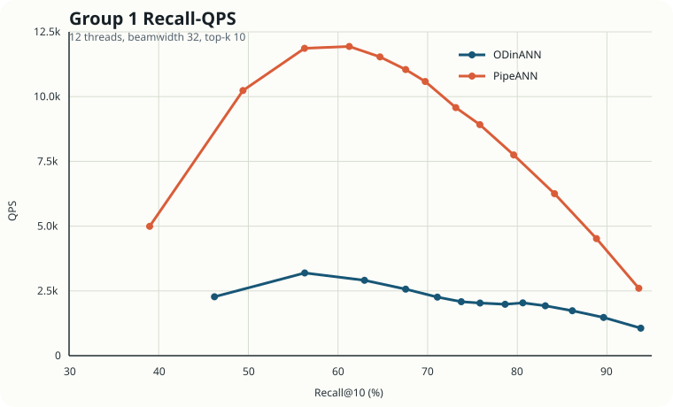
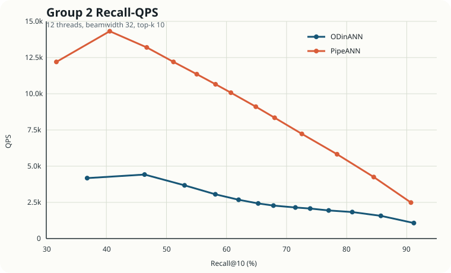

# ODinANN 与 PipeANN 两组对比实验报告

## 1. 实验目的

本报告用于整理服务器脚本 `run_pipeann_verify_server.sh` 的两组实测结果，展示在相同二进制程序、相同查询集和相同搜索线程配置下，ODinANN 基线与 PipeANN 的性能对比。说明通过PipeANN的方式生成的随机入口点搜索效果优于静态入口点。

本次实验使用的关键程序与本地仓库保持一致，核心涉及：

- `tests/utils/gen_random_slice.cpp`：从原始大规模数据集中按采样率抽样，生成小规模抽样数据和对应 ID 文件。
- `tests/build_memory_index.cpp`：基于抽样数据构建 PipeANN 所需的小型内存索引。
- `tests/search_disk_index.cpp`：统一执行基线搜索与 PipeANN 搜索。

## 2. 实验流程

服务器端脚本的流程可以概括为四步：

1. 检查二进制文件、磁盘索引、PQ 文件、原始数据集、查询集和真值文件是否齐备。
2. 如果内存索引不存在，则先运行 `gen_random_slice`，再运行 `build_memory_index`。
3. 使用 `search_mode=0` 运行基线搜索，得到本报告中记为 ODinANN 的结果。
4. 使用 `search_mode=2`、`mem_L=10` 运行 PipeANN 搜索，并与基线输出逐项对比。

实验脚本中固定的重要参数如下：

| 参数 | 取值 |
| --- | --- |
| 数据类型 | `uint8` |
| 数据集 | `BIGANN_1B.u8bin` |
| Top-K | `10` |
| 搜索线程数 | `12` |
| Beamwidth / I/O Width | `32` |
| PipeANN 内存索引搜索参数 `mem_L` | `10` |
| 抽样率 | `0.01` |
| 内存索引构建参数 | `R=32, L=64, alpha=1.2, threads=24` |
| 对比的磁盘搜索 `L` | `10, 15, 20, 25, 30, 35, 40, 50, 60, 80, 120, 200, 400` |

对应命令与脚本逻辑一致：

```bash
# 1) 生成抽样数据
build/tests/utils/gen_random_slice uint8 ${DATA_PATH} ${INDEX_PREFIX}_SAMPLE_RATE_0.01 0.01

# 2) 构建 PipeANN 小内存索引
build/tests/build_memory_index uint8 \
  ${INDEX_PREFIX}_SAMPLE_RATE_0.01_data.bin \
  ${INDEX_PREFIX}_SAMPLE_RATE_0.01_ids.bin \
  ${INDEX_PREFIX}_mem.index \
  0 0 32 64 1.2 24 l2

# 3) ODinANN 基线
build/tests/search_disk_index uint8 ${INDEX_PREFIX} 12 32 \
  ${QUERY_PATH} ${TRUTH_PATH} 10 l2 0 0 \
  10 15 20 25 30 35 40 50 60 80 120 200 400

# 4) PipeANN
build/tests/search_disk_index uint8 ${INDEX_PREFIX} 12 32 \
  ${QUERY_PATH} ${TRUTH_PATH} 10 l2 2 10 \
  10 15 20 25 30 35 40 50 60 80 120 200 400
```

## 3. 补充说明

在上述流程中，抽样阶段和小内存索引构建阶段会额外生成一批辅助文件，包括：

- `${INDEX_PREFIX}_SAMPLE_RATE_0.01_data.bin`
- `${INDEX_PREFIX}_SAMPLE_RATE_0.01_ids.bin`
- `${INDEX_PREFIX}_mem.index`
- `${INDEX_PREFIX}_mem.index.data`
- `${INDEX_PREFIX}_mem.index.tags`

这些新增的小索引和抽样数据文件合计大约占用 **2.5GB** 磁盘空间，耗时约10分钟。这个开销相对原始 1B 级数据和磁盘索引是可接受的，但在展示和复现实验时需要提前说明。

## 4. Recall-QPS 对比图

### 第一组实验



### 第二组实验



## 5. 结果分析

### 5.1 第一组实验结论

第一组实验中，PipeANN 在整个 recall 区间基本都明显高于 ODinANN，尤其是在中等到高 recall 区间优势最明显。

几个可直接对齐的代表点如下：

| 对比点 | ODinANN | PipeANN | QPS 提升 |
| --- | --- | --- | --- |
| Recall 约 `56.3` | `56.29 @ 3191.67 QPS` | `56.27 @ 11865.60 QPS` | `3.72x` |
| Recall `67.55` | `67.55 @ 2568.14 QPS` | `67.55 @ 11045.19 QPS` | `4.30x` |
| Recall 约 `75.8` | `75.85 @ 2032.31 QPS` | `75.83 @ 8916.28 QPS` | `4.39x` |
| Recall 约 `93.7` | `93.78 @ 1060.56 QPS` | `93.56 @ 2603.42 QPS` | `2.45x` |

从这组数据可以看到：

- 在几乎相同的召回率下，PipeANN 的 QPS 提升大多落在 `2.4x` 到 `4.4x`。
- PipeANN 的平均延迟和 P99 延迟也明显更低。
- 在高 recall 端，PipeANN 的优势仍然存在，只是随着召回率逼近上限，速度增益有所收敛。

### 5.2 第二组实验结论

第二组实验也呈现出相同趋势，PipeANN 的曲线整体位于 ODinANN 之上。

代表点如下：

| 对比点 | ODinANN | PipeANN | QPS 提升 |
| --- | --- | --- | --- |
| Recall 约 `46.5` | `46.36 @ 4421.32 QPS` | `46.72 @ 13200.42 QPS` | `2.99x` |
| Recall 约 `58.2` | `58.14 @ 3057.01 QPS` | `58.17 @ 10656.53 QPS` | `3.49x` |
| Recall 约 `68.0` | `67.81 @ 2280.07 QPS` | `68.01 @ 8342.89 QPS` | `3.66x` |
| Recall 约 `91.0` | `91.19 @ 1075.22 QPS` | `90.70 @ 2486.47 QPS` | `2.31x` |

从第二组结果可以得出：

- PipeANN 在中低 recall 和高 recall 区间都保持了稳定优势。
- 即使在接近 `91%` 的高召回率附近，PipeANN 仍能提供大约 `2.3x` 的吞吐提升。
- 第二组实验的总体趋势与第一组一致，说明这种优势并不是单次偶然波动。

### 5.3 综合结论

两组实验共同说明：

1. 在相同线程数、相同 beamwidth、相同查询集以及相同磁盘索引基础上，PipeANN 能够在接近相同 recall 的条件下显著提高 QPS。
2. PipeANN 的收益在中高 recall 区间尤其明显，很多对比点可以达到 `3x` 以上吞吐提升。
3. 为获得这部分性能收益，只需要额外执行抽样和小内存索引构建这两个准备步骤，新增磁盘开销约 `2.5GB`，工程代价较低。

## 6. 原始结果

### 第一组实验原始输出

<details>
<summary>展开查看第一组实验原始结果</summary>

```text
ODinANN Search parameters: #threads: 12,  beamwidth: 32
     L   I/O Width         QPS  AvgLat(us)     P99 Lat   Mean Hops    Mean IOs   Recall@10
=========================================================================================
    10          32     2275.23     5240.12    24204.00       15.54      116.12       46.22
    15          32     3191.67     3727.18    17902.00       15.47      169.03       56.29
    20          32     2910.90     4090.05    18481.00       15.41      221.64       62.95
    25          32     2568.14     4638.05    18601.00       15.40      273.97       67.55
    30          32     2262.09     5267.37    19114.00       15.39      326.12       71.08
    35          32     2082.61     5724.00    19791.00       15.40      363.40       73.75
    40          32     2032.31     5868.28    19714.00       15.50      373.92       75.85
    50          32     1984.34     6009.90    19553.00       15.78      387.66       78.64
    60          32     2037.97     5853.16    12501.00       16.05      397.98       80.62
    80          32     1926.70     6192.88    15016.00       16.56      415.34       83.13
   120          32     1735.47     6878.74    18122.00       17.53      446.93       86.14
   200          32     1476.89     8087.14    19189.00       19.54      514.87       89.63
   400          32     1060.56    11272.18    24859.00       25.08      700.25       93.78

PipeANN Search parameters: #threads: 12,  beamwidth: 32
     L   I/O Width         QPS  AvgLat(us)     P99 Lat   Mean Hops    Mean IOs   Recall@10
=========================================================================================
    10          32     4994.80     2389.73     6485.00        0.00       20.46       38.99
    15          32    10236.50     1160.19     3524.00        0.00       30.65       49.40
    20          32    11865.60      998.74     2742.00        0.00       38.83       56.27
    25          32    11934.96      991.17     2631.00        0.00       46.24       61.26
    30          32    11532.27     1024.44     2400.00        0.00       52.83       64.68
    35          32    11045.19     1069.05     2353.00        0.00       59.07       67.55
    40          32    10583.77     1115.23     2305.00        0.00       64.96       69.73
    50          32     9574.96     1232.93     2496.00        0.00       75.82       73.14
    60          32     8916.28     1322.04     2658.00        0.00       86.68       75.83
    80          32     7749.23     1520.76     3065.00        0.00      106.97       79.60
   120          32     6251.73     1884.74     3395.00        0.00      146.54       84.15
   200          32     4519.94     2603.50     4998.00        0.00      222.37       88.84
   400          32     2603.42     4525.67     8257.00        0.00      414.85       93.56
```

</details>

### 第二组实验原始输出

<details>
<summary>展开查看第二组实验原始结果</summary>

```text
ODinANN Search parameters: #threads: 12,  beamwidth: 32
     L   I/O Width         QPS  AvgLat(us)     P99 Lat   Mean Hops    Mean IOs   Recall@10
=========================================================================================
    10          32     4176.61     2851.87    15722.00       13.37       95.07       36.81
    15          32     4421.32     2690.21     4998.00       13.46      139.68       46.36
    20          32     3674.70     3241.75     5891.00       13.50      183.86       53.02
    25          32     3057.01     3898.42    14926.00       13.51      227.75       58.14
    30          32     2681.90     4445.78    15748.00       13.52      271.46       62.02
    35          32     2424.92     4918.81     9245.00       13.55      303.66       65.28
    40          32     2280.07     5232.60    18117.00       13.67      314.43       67.81
    50          32     2149.21     5552.27    18088.00       13.95      328.56       71.47
    60          32     2073.33     5755.10    18596.00       14.26      339.20       73.93
    80          32     1941.49     6148.96    19422.00       14.79      357.08       77.01
   120          32     1833.39     6514.02    14620.00       15.81      389.43       80.93
   200          32     1571.37     7606.18    11966.00       17.87      457.84       85.69
   400          32     1075.22    11124.29    21659.00       23.51      643.88       91.19

PipeANN Search parameters: #threads: 12,  beamwidth: 32
     L   I/O Width         QPS  AvgLat(us)     P99 Lat   Mean Hops    Mean IOs   Recall@10
=========================================================================================
    10          32    12201.53      969.71     2423.00        0.00       24.14       31.68
    15          32    14318.09      824.40     1745.00        0.00       33.45       40.56
    20          32    13200.42      893.96     1862.00        0.00       41.09       46.72
    25          32    12202.04      965.90     1988.00        0.00       47.97       51.17
    30          32    11353.35     1036.74     2125.00        0.00       54.52       55.05
    35          32    10656.53     1104.80     2111.00        0.00       60.76       58.17
    40          32    10072.42     1169.15     2298.00        0.00       66.78       60.73
    50          32     9105.34     1293.38     2525.00        0.00       78.19       64.88
    60          32     8342.89     1410.30     2720.00        0.00       89.06       68.01
    80          32     7229.36     1625.96     3140.00        0.00      109.76       72.55
   120          32     5824.58     2018.21     3733.00        0.00      149.86       78.40
   200          32     4248.40     2762.05     4917.00        0.00      225.82       84.51
   400          32     2486.47     4721.52    16472.00        0.00      417.59       90.70
```

</details>

## 7. 备注

- 本报告中的基线名称沿用实验记录中的 `ODinANN` 表述；从代码路径上看，基线阶段对应的是 `search_disk_index.cpp` 中 `search_mode=0` 的搜索路径。
- 当前实验输出里 PipeANN 的 `Mean Hops` 为 `0.00`，因此本报告重点比较 `Recall`、`QPS`、延迟和 `Mean IOs`。
- 仓库 README 已明确说明该项目是 PipeANN 与 OdinANN 的集成版本，因此本报告使用 `ODinANN vs PipeANN` 的展示方式与仓库定位一致。
