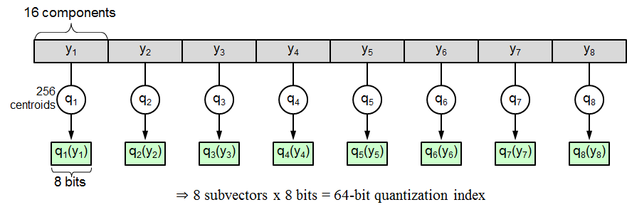
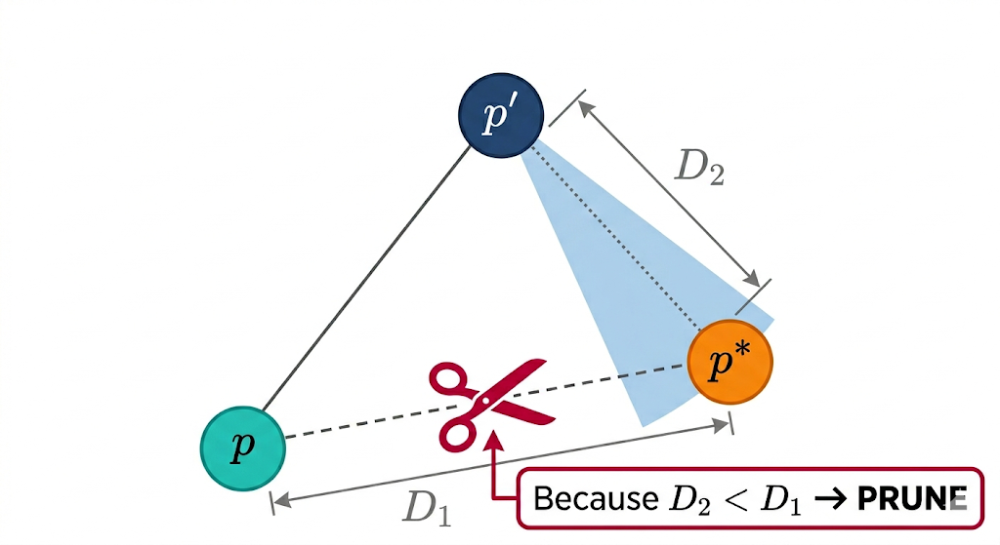
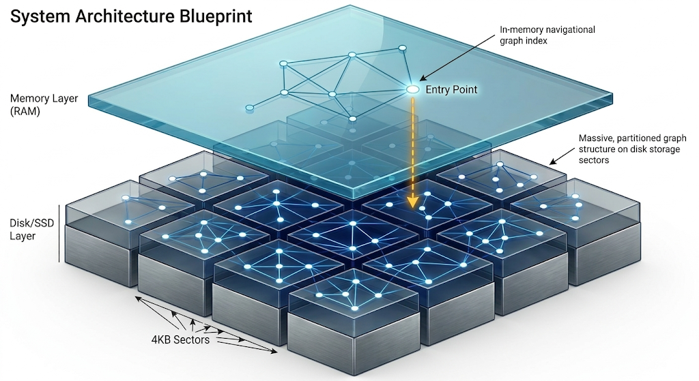
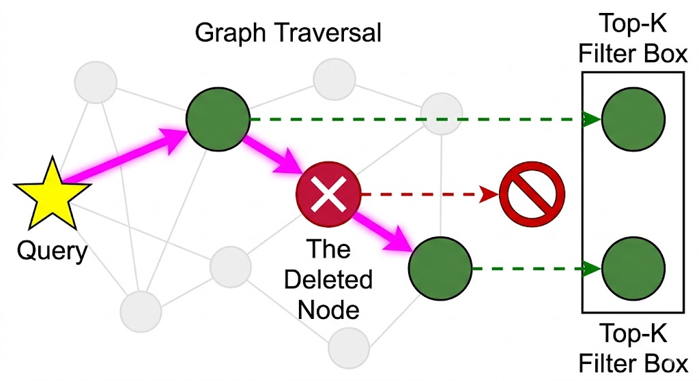
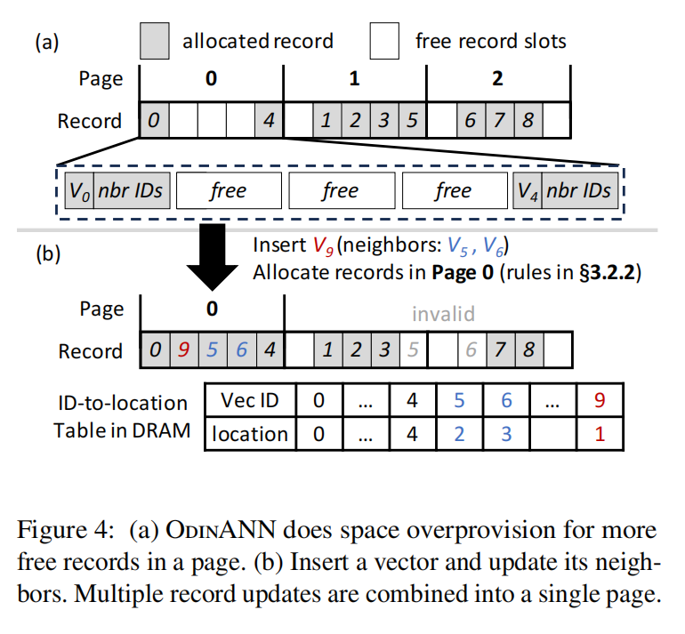
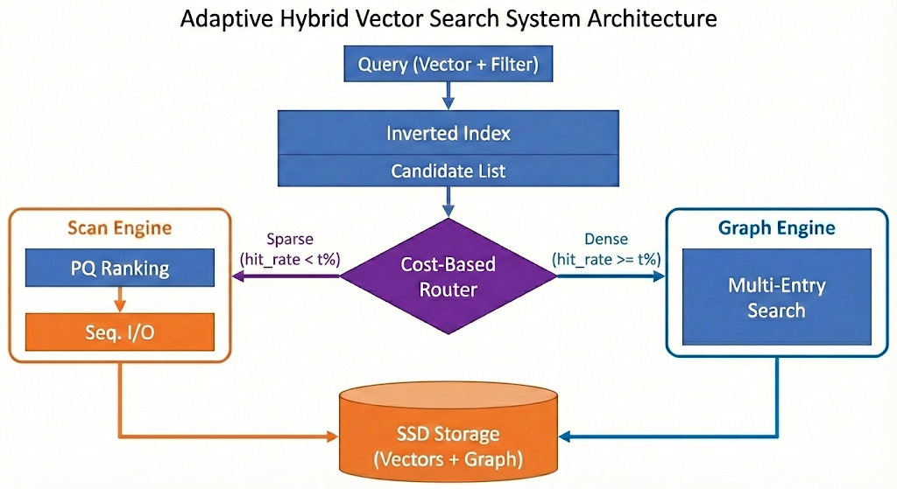
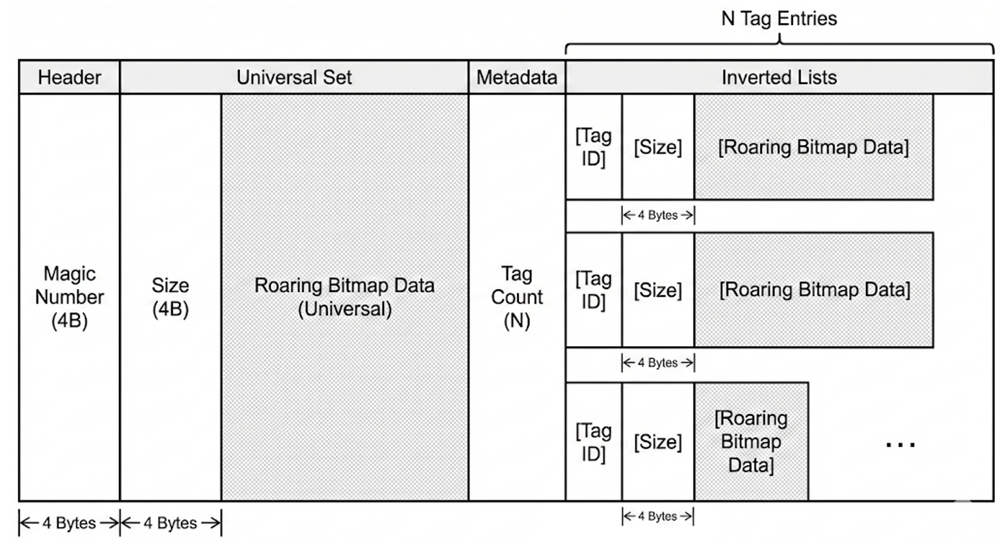
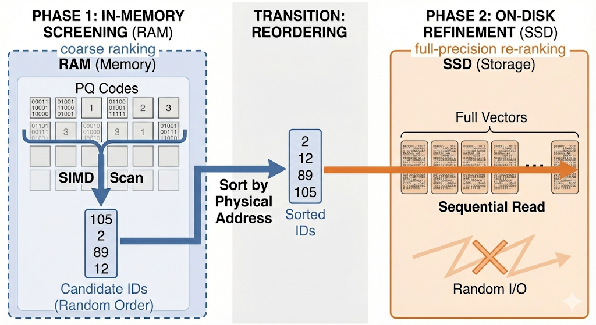
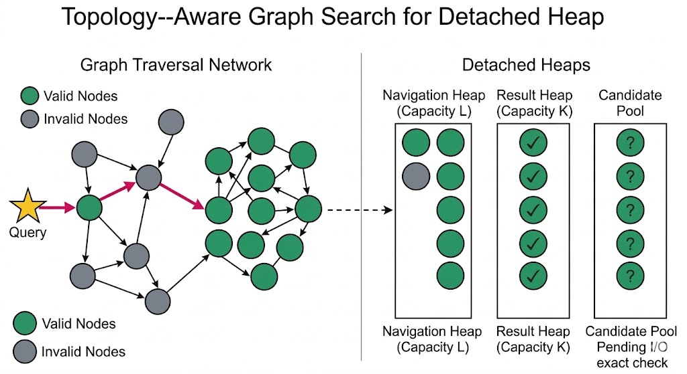
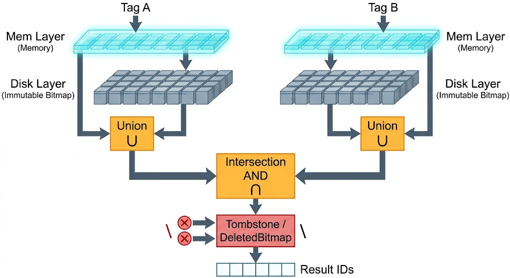

# 原型系统的索引构建、查询、更新、混合检索原理

## 构建

构建阶段负责将原始的高维向量转化为高效的磁盘和内存混合索引结构。

* **数据预处理与 PQ 训练**：系统首先会对数据进行采样（`gen_random_slice`）。对于 Cosine 距离度量，系统会自动将其转换为 L2 距离并进行归一化，以提升精度。随后，利用 K-means 算法（`kmeanspp_selecting_pivots` 和 `run_lloyds`）训练乘积量化（PQ）码本，并将高维数据压缩为紧凑的 PQ 编码，如下图所示。

  

* **内存 Vamana 图构建**：在内存中，系统使用单遍（One-pass）贪婪搜索策略构建 Vamana 图（`link` 函数）。核心在于引入了 Alpha 剪枝机制（`prune_neighbors` 和 `occlude_list`），通过控制度数上限（参数 `R` 和 `C`）来剔除冗余边，从而在保证图连通性的同时维持图的稀疏性，剪枝逻辑如下图所示，其中 $p^{'}$ 为已有邻居， $p^{*}$ 为候选邻居 。

  

* **磁盘布局与分片**：完成图构建后，系统会将邻接表与向量数据合并，这是为了搜索时能在读取某个向量邻接表时“免费地”获取其精确的向量表示，最大程度减少I/O次数。为了减少 I/O 放大，数据被严格按照扇区大小（如 4KB，`SECTOR_LEN`）进行对齐组织。对于超大规模数据集，系统会调用 RAM 预算受限的分片策略（`partition_with_ram_budget`），将数据切分为多个子集群。

* **映射表初始化**：系统会初始化专门的标签映射结构（`_tag_to_location` 和 `_location_to_tag`），将外部业务的 Tag 映射为内部连续的 Location ID，为后续的动态读写打下基础。

## 搜索

搜索流程采用了“内存缓存导航 + 磁盘图遍历”的两级混合架构，并深度整合了动态过滤。

- **入口定位与两级架构**：查询请求首先进入常驻内存的图结构中，找到距离查询向量最近的候选节点作为磁盘搜索的入口点（Entry Point, `_ep`）。注意，这里的入口点可以有多个，会被加入初始候选队列中。结构示意如下图所示。

  

- **逻辑删除与跳板路由**：在通过 ID 扩展邻居时，系统会实时比对内存中的删除集合（`_delete_set`）。如果遇到已被删除的节点，系统不会将其放入最终结果集，但仍允许其参与图的连通性扩展（即作为“跳板”寻找其他未删除的有效邻居），以避免破坏图的搜索路径，如下图所示。

  

- **磁盘 I/O 与 PQ 降维加速**：系统使用内部 ID 转换为物理扇区地址，通过异步 I/O 加载数据页面。为了加速距离计算，利用加载的压缩向量调用 `compute_pq_dists` 进行快速的粗筛。只有距离较优的少数候选节点，才会读取其精确向量数据进行精准重排。

## 更新

更新系统以无锁/细粒度锁和懒惰删除为核心，采用就地更新而非基于LSM结构的方法，兼顾了高并发性能与数据一致性。不论是插入操作还是删除操作，执行完毕后均可立刻在新搜索中体现。

- **RMW 与细粒度锁插入**：插入新节点（`insert_point`）时，系统采用细粒度锁（`v2::LockGuard` 和 `v2::LockTable`）锁定目标页面。系统通过执行搜索过程寻找最合适的空闲槽位（优先复用 `_empty_slots` 中的位置，否则分配新位置 `reserve_location`），读取邻居节点信息并在内存中更新反向边（`inter_insert`），随后将修改后的页面安全回写。同时，为了解决就地更新带来的大量磁盘写问题，系统采取将多个更新合并写入一个页面的方法减少磁盘写，并且通过更新ID-to-location表来逻辑覆盖之前的邻接表信息，如下图所示。

  

- **逻辑删除 (Lazy Delete) 与异地更新**：针对删除操作，系统调用 `lazy_delete` 将目标映射对应的内部 ID 压入 `_delete_set`，同时从 `_tag_to_location` 等映射表中移除，实现轻量级的逻辑删除。更新操作则自然转化为“逻辑删除旧 Tag + 物理插入新数据”，有效规避了原地修改引发的锁竞争和数据覆盖风险。

- **后台碎片整理与垃圾回收 (GC)**：当积压的删除节点（`_delete_set`）达到一定比例，后台将触发 `consolidate_deletes` 流程。该流程会扫描并修复因删除造成的图结构断层：将指向死节点的边重定向到死节点的存活邻居上（修补桥接），如下图所示。最后，通过 `compact_data` 移动物理数据，重新编号连续的内部 ID，以彻底回收存储空间并保持索引结构的紧凑性。

  

## 混合检索

### 基本检索实现原理

#### 1. 自适应路由 (Adaptive Routing)

系统不是死板地执行某一种算法，而是根据**命中率 (Hit Rate)** 动态决策，如下图所示。

- **决策依据**：通过倒排索引（Roaring Bitmap）执行 `AND/OR` 逻辑运算，快速得到满足标签的候选集大小 $|\mathcal{C}|$。

- **计算选择率**：$\sigma = |\mathcal{C}| / N$（$N$ 为总向量数）。

- **路由逻辑**：

  > $t$ 为可以设定的参数

  - **Sparse（稀疏）**：当 $\sigma < t\%$，满足条件的点散落在磁盘各处。此时走图搜索会频繁触发随机 I/O 且易丢结果，系统切换至**两阶段扫描**。
  - **Dense（稠密）**：当 $\sigma \ge t\%$，候选点足够多，图的连通性较好。系统切换至**拓扑感知图搜索**。

***

#### 2. 标签倒排索引的物理存储结构

为了适配亿级（Billion-scale）数据，标签倒排索引摒弃了传统的链表结构，采用了**平铺序列化（Flat Serialization）**格式，并基于 **Roaring Bitmap** 进行压缩。索引文件在磁盘上由四个连续的块组成，如下图所示：

1. **Header（头部）**：包含 Magic Number（校验位）和版本号，用于文件完整性检查。
2. **Universal Set（全量集/万能位图）**：这是一个特殊的优化。它记录了拥有“通用标签”或满足所有基本过滤条件的向量 ID。查询时，这个集合可以快速与特定标签位图进行 `OR` 运算。
3. **Metadata（元数据）**：存储标签总数 $N$ 以及每个标签对应的位图在文件中的偏移量（Offset）。
4. **Inverted Lists Body（倒排列表主体）**：这是索引的核心。每个标签 ID 对应一个独立编码的 Roaring Bitmap。

> **为什么选择 Roaring Bitmap？**
>
> - **高压缩比**：对于稠密分布的 ID，它使用位图存储；对于稀疏分布，使用数组存储；对于连续 ID，使用运行长度编码（RLE）。这使得十亿级标签的内存占用极低。
> - **SIMD 加速**：Roaring Bitmap 的位运算（AND, OR, NOT）支持 CPU 指令集加速，在处理百万级 ID 的交集运算时，延迟通常在微秒（$\mu s$）级别。

#### 3. 稀疏场景：I/O 友好型两阶段扫描

这是针对传统 `mmap` 暴力扫描导致“随机 I/O 膨胀”问题的优化，具体流程如下图所示。

1. **第一阶段：内存 PQ 粗排（Zero-I/O）**

   利用 DiskANN 索引中常驻内存的 PQ 压缩向量，使用 **AVX2/AVX-512** 指令集进行向量化计算。计算完成后，在内存中对所有满足标签的 $|\mathcal{C}|$ 个点计算 PQ 距离。最后筛选出最多 $K' = L \times \text{multiplier}$ 个候选 ID（例如 $K'=2000$），其中 $multiplier$ 为可以设定的参数。

2. **第二阶段：顺序 I/O 精确重排**

   将这 $K'$ 个 ID 按照其在磁盘上的**偏移量（Offset）进行升序排列**。这样当向 SSD 发起读取请求时，原本乱序的随机访问变成了“单向扫描”，SSD 的固件能更好地进行预读，以提升吞吐量。最后读取全精度向量，计算 L2/IP 距离，返回最终 Top-K。

------

#### 4. 稠密场景：拓扑感知图搜索 (Graph Engine)

> 解决了“过滤饥饿”和“连通性断裂”的痛点问题。如下图所示：

##### 核心机制：分离堆管理 (Detached Heap)

系统同时维护两个优先级队列：

1. **导航堆 (Navigation Heap)**：容量为 $L$。不管节点符不符合标签，只要距离近就入堆。这保证了搜索能通过“非合规节点”作为跳板，跳向远处的“合规节点”集群，维持了小世界网络的导航性。
2. **结果堆 (Result Heap)**：容量为 $K$。只记录满足标签约束且经过精确距离校验的节点。

##### 搜索流程中的 “I/O加速”

- **并发读取**：每轮弹出 `beam_width` 个导航点，一次性发起异步磁盘读取。
- **数据复用**：读回来的 4KB 页面中，不仅包含邻居 ID，还包含了该节点自身的**全精度向量**。
- **即时校验**：如果该点满足标签，直接用页面里的全精度向量计算距离，更新“结果堆”。这次精确计算是伴随图导航发生的，**I/O 成本为 0**。

##### 海选池 (Candidate Heap) 机制

为了防止 PQ 误差导致漏掉潜在的好点，系统设计了 `pq_candidate_heap`：

- 只要在导航过程中“路过”的邻居满足标签，就先塞进海选池。
- 搜索结束后，对池中那些还没被“免费校验”过的点，发起最后一波 Batch I/O 进行最终排序。

### 混合检索相关更新实现原理

为了解决“新增向量标签如何即时生效”的问题，采用了类似数据库 LSM-Tree 的设计。

#### 双层存储架构

- **Disk 层**：静态的 Roaring Bitmap 文件，读取快，不可变。
- **Mem 层 (MemIndex)**：一个 `std::unordered_map<Tag, roaring::Roaring>`。新插入向量的标签直接写在这里。
- **墓碑层 (DeletedBitmap)**：记录所有被删除向量的全局位图。

#### 查询合并逻辑

如上图所示，当用户查询 `Tag_A AND Tag_B` 时，内部执行：

$$Result = \underbrace{(Disk_A \cup Mem_A)}_{\text{所有 A}} \cap \underbrace{(Disk_B \cup Mem_B)}_{\text{所有 B}} \setminus \text{DeletedBitmap}$$

- **性能**：Roaring Bitmap 的位运算极快（$10^6$ 级数据通常 $< 1ms$）。

- **持久化**：操作同步写入 **WAL (预写日志)**。重启时重放 WAL 即可恢复 `MemIndex` 和 `DeletedBitmap`。

- **合并 (Compaction)**：当 `MemIndex` 达到阈值，后台线程将内存位图与磁盘位图合并，生成新的 `ivf.index`。

  - 后台线程启动 Merge，遍历目前存在的所有标签并计算：

    `New_DiskIndex[Tag] = (Old_DiskIndex[Tag] | MemIndex[Tag]) - DeletedBitmap;`

  - 将 `New_DiskIndex` 按照之前的格式重新序列化到磁盘。

  - 清空当前的 `MemIndex` 和 `DeletedBitmap`。

## 参考文献

1. Guo H, Lu Y. Odinann: Direct insert for consistently stable performance in billion-scale graphbased vector search[C]//24th USENIX Conference on File and Storage Technologies (FAST 26), Santa Clara, CA. 2026.
2. Jayaram Subramanya S, Devvrit F, Simhadri H V, et al. Diskann: Fast accurate billion-point nearest neighbor search on a single node[J]. Advances in neural information processing Systems, 2019, 32.