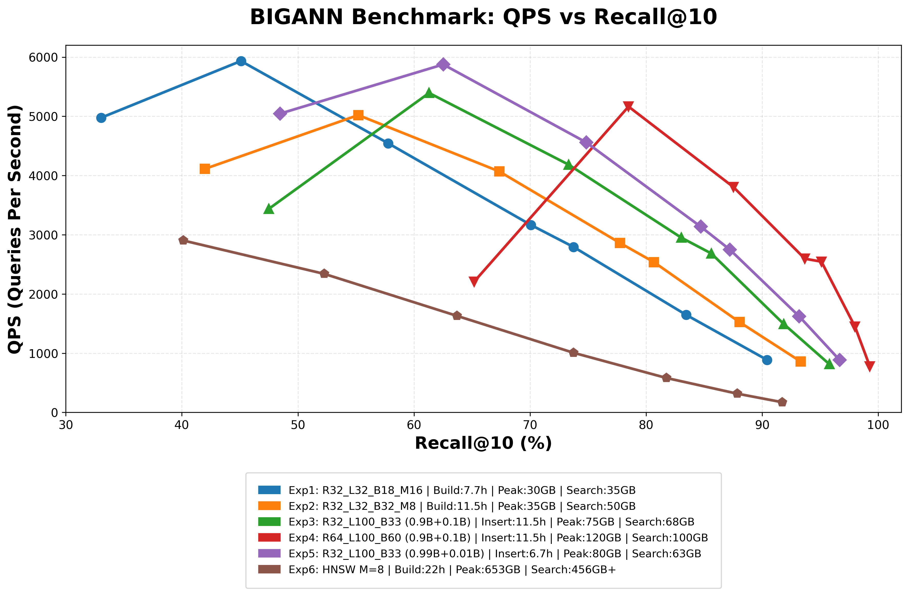

# BIGANN 索引构建与动态更新实验报告

## 1. 实验说明

- BIGANN 测试环境：`187` 服务器，基于 `NVMe SSD`。
- HNSW 基线环境：`214` 服务器，基于 `PostgreSQL + pgvector`。
- 测试内容包括全量索引构建、增量插入、搜索内存消耗以及 `QPS / Recall@10` 对比。

## 2. 总体结果汇总

| 方案 | 数据规模 | 构建/插入耗时 | 峰值内存 | 搜索内存 | 最高 Recall@10 | 峰值 QPS |
| :--- | :--- | :--- | :--- | :--- | :--- | :--- |
| `R32_L32_B18_M16` | 1B | 7.7h | 30 GB | 35 GB | 90.43% | 5933.81 |
| `R32_L32_B32_M8` | 1B | 11.5h | 35 GB | 50 GB | 93.33% | 5020.42 |
| `R32_L100_B33` | 0.9B + 0.1B | 11.5h | 75 GB | 68 GB | 95.79% | 5393.84 |
| `R64_L100_B60` | 0.9B + 0.1B | 11.5h | 120 GB | 100 GB | 99.28% | 5164.07 |
| `R32_L100_B33` | 0.99B + 0.01B | 6.7h | 80 GB | 63 GB | 96.68% | 5875.48 |
| `HNSW M=8, efc=100` | 1B | 22h | 653 GB | 456 GB+ | 91.74% | 2902.25 |

## 3. 综合对比图

下图展示了各实验方案在 `QPS` 与 `Recall@10` 之间的整体关系。

## 4. 各组实验结果

实验 1：BIGANN 1B，R32_L32_B18_M16，T=44

构建时间 `7.7h`，峰值内存 `30 GB`，搜索内存 `35 GB`。

| L | I/O Width | QPS | AvgLat(us) | P99 Lat | Mean Hops | Mean IOs | Recall@10 |
| :--- | :--- | :--- | :--- | :--- | :--- | :--- | :--- |
| 10 | 4 | 4976.86 | 2393.77 | 10645.00 | 15.27 | 53.03 | 33.05 |
| 20 | 4 | 5933.81 | 2007.08 | 4033.00 | 18.04 | 64.55 | 45.09 |
| 40 | 4 | 4544.04 | 2623.63 | 5260.00 | 22.87 | 84.14 | 57.78 |
| 80 | 4 | 3165.58 | 3771.68 | 6822.00 | 32.30 | 122.17 | 70.07 |
| 100 | 4 | 2793.38 | 4277.77 | 9583.00 | 37.09 | 141.41 | 73.75 |
| 200 | 4 | 1647.47 | 7262.72 | 17796.00 | 61.31 | 238.66 | 83.45 |
| 400 | 4 | 886.04 | 13511.61 | 20962.00 | 110.67 | 436.49 | 90.43 |

实验 2：BIGANN 1B，R32_L32_B32_M8，T=44

构建时间 `11.5h`，峰值内存 `35 GB`，搜索内存 `50 GB`。

| L | I/O Width | QPS | AvgLat(us) | P99 Lat | Mean Hops | Mean IOs | Recall@10 |
| :--- | :--- | :--- | :--- | :--- | :--- | :--- | :--- |
| 10 | 4 | 4112.23 | 2893.97 | 7970.00 | 17.75 | 63.02 | 41.98 |
| 20 | 4 | 5020.42 | 2361.25 | 5060.00 | 20.42 | 74.14 | 55.20 |
| 40 | 4 | 4068.73 | 2928.26 | 5735.00 | 25.20 | 93.53 | 67.35 |
| 80 | 4 | 2862.30 | 4168.96 | 8321.00 | 34.57 | 131.38 | 77.74 |
| 100 | 4 | 2538.06 | 4704.59 | 8750.00 | 39.28 | 150.38 | 80.67 |
| 200 | 4 | 1524.72 | 7842.58 | 15742.00 | 63.53 | 247.73 | 88.05 |
| 400 | 4 | 857.34 | 13958.30 | 39433.00 | 112.87 | 445.48 | 93.33 |

实验 3：BIGANN 0.9B + 0.1B，R32_L100_B33

插入耗时 `11.5h`，峰值内存 `75 GB`，搜索内存 `68 GB`。

| L | I/O Width | QPS | AvgLat(us) | P99 Lat | Mean Hops | Mean IOs | Recall@10 |
| :--- | :--- | :--- | :--- | :--- | :--- | :--- | :--- |
| 10 | 4 | 3438.15 | 3456.13 | 14889.00 | 15.47 | 54.05 | 47.50 |
| 20 | 4 | 5393.84 | 2192.88 | 8329.00 | 18.02 | 64.66 | 61.30 |
| 40 | 4 | 4183.15 | 2834.20 | 9021.00 | 22.67 | 83.55 | 73.33 |
| 80 | 4 | 2949.88 | 4036.15 | 7666.00 | 31.99 | 121.27 | 83.04 |
| 100 | 4 | 2683.93 | 4444.78 | 7383.00 | 36.77 | 140.49 | 85.62 |
| 200 | 4 | 1491.08 | 8015.78 | 21882.00 | 61.09 | 238.17 | 91.87 |
| 400 | 4 | 814.31 | 14691.09 | 31773.00 | 110.46 | 436.15 | 95.79 |

实验 4：BIGANN 0.9B + 0.1B，R64_L100_B60

插入耗时 `11.5h`，峰值内存 `120 GB`，搜索内存 `100 GB`。

| L | I/O Width | QPS | AvgLat(us) | P99 Lat | Mean Hops | Mean IOs | Recall@10 |
| :--- | :--- | :--- | :--- | :--- | :--- | :--- | :--- |
| 10 | 4 | 2206.62 | 5382.14 | 18544.00 | 13.19 | 45.70 | 65.18 |
| 20 | 4 | 5164.07 | 2283.00 | 7142.00 | 15.41 | 55.03 | 78.49 |
| 40 | 4 | 3806.42 | 3110.75 | 14250.00 | 19.86 | 73.23 | 87.52 |
| 80 | 4 | 2594.87 | 4583.74 | 20278.00 | 29.23 | 111.20 | 93.68 |
| 100 | 4 | 2545.77 | 4680.52 | 14557.00 | 34.06 | 130.64 | 95.11 |
| 200 | 4 | 1448.95 | 8245.27 | 18246.00 | 58.56 | 229.09 | 98.00 |
| 400 | 4 | 777.89 | 15365.29 | 32296.00 | 108.15 | 427.77 | 99.28 |

实验 5：BIGANN 0.99B + 0.01B，R32_L100_B33

插入耗时 `6.7h`，峰值内存 `80 GB`，搜索内存 `63 GB`。

| L | I/O Width | QPS | AvgLat(us) | P99 Lat | Mean Hops | Mean IOs | Recall@10 |
| :--- | :--- | :--- | :--- | :--- | :--- | :--- | :--- |
| 10 | 4 | 5045.00 | 2357.85 | 5473.00 | 15.68 | 54.88 | 48.46 |
| 20 | 4 | 5875.48 | 2026.71 | 6489.00 | 18.15 | 65.28 | 62.52 |
| 40 | 4 | 4559.00 | 2616.54 | 4991.00 | 22.75 | 83.99 | 74.85 |
| 80 | 4 | 3136.52 | 3807.56 | 17613.00 | 32.09 | 121.74 | 84.71 |
| 100 | 4 | 2750.49 | 4344.92 | 10144.00 | 36.86 | 140.95 | 87.21 |
| 200 | 4 | 1620.50 | 7384.61 | 13730.00 | 61.15 | 238.53 | 93.20 |
| 400 | 4 | 883.80 | 13546.37 | 22124.00 | 110.57 | 436.61 | 96.68 |

实验 6：HNSW 基线，M=8，EFC=100，T=16

构建耗时 `22h`，构建内存 `653 GB`，搜索内存 `456 GB+`。

| ef_search | QPS | AvgLat(ms) | Recall |
| :--- | :--- | :--- | :--- |
| 16 | 2902.25 | 3.11 | 0.4013 |
| 32 | 2339.20 | 4.11 | 0.5227 |
| 64 | 1630.39 | 6.29 | 0.6370 |
| 128 | 1006.65 | 10.90 | 0.7375 |
| 256 | 581.36 | 19.60 | 0.8175 |
| 512 | 316.48 | 36.84 | 0.8785 |
| 1000 | 171.53 | 68.84 | 0.9174 |

## 5. 结果分析

### 5.1 内存消耗

与 HNSW 相比，BIGANN 在构建阶段的峰值内存为 `30 GB ~ 120 GB`，明显低于 HNSW 的 `653 GB`；搜索阶段内存为 `35 GB ~ 100 GB`，低于 HNSW 的 `456 GB+`。

### 5.2 构建与插入耗时

- 全量构建场景下，`R32_L32_B18_M16` 用时最短，为 `7.7h`。
- 全量构建中，`R32_L32_B32_M8` 用时 `11.5h`，但召回率上限高于 `R32_L32_B18_M16`。
- 增量插入场景中，`0.99B + 0.01B` 的 `R32_L100_B33` 用时 `6.7h`，低于 `0.9B + 0.1B` 场景下的 `11.5h`。

### 5.3 查询性能与召回率

- `R32_L32_B18_M16` 的优势在于构建快、内存低，但召回率上限相对较低。
- `R32_L32_B32_M8` 在搜索内存增加的情况下，将最高 Recall@10 提升到 `93.33%`。
- `R32_L100_B33` 在增量场景下表现较均衡，兼顾 Recall、QPS 和资源消耗。
- `R64_L100_B60` 的最高 Recall@10 达到 `99.28%`，但对应的构建和搜索内存也最高。

### 5.4 动态更新稳定性

动态更新测试结果表明：

- 在相同 Recall@10 目标下，QPS 损失控制在 `20%` 以内。
- 更新后的 Recall@10 降幅不高于 `5%`。

说明索引在批量更新后仍能保持较稳定的查询性能和检索精度。

## 6. 结论

- BIGANN 在本组实验中表现出更低的内存消耗。
- 在 1B 规模下，BIGANN 的构建与增量插入耗时整体可控。
- 不同参数配置可在内存、构建耗时、QPS 和 Recall 之间进行权衡。
- 若以高召回率为目标，`R64_L100_B60` 表现最好；若更关注资源消耗，`R32_L32_B18` 更有优势。
